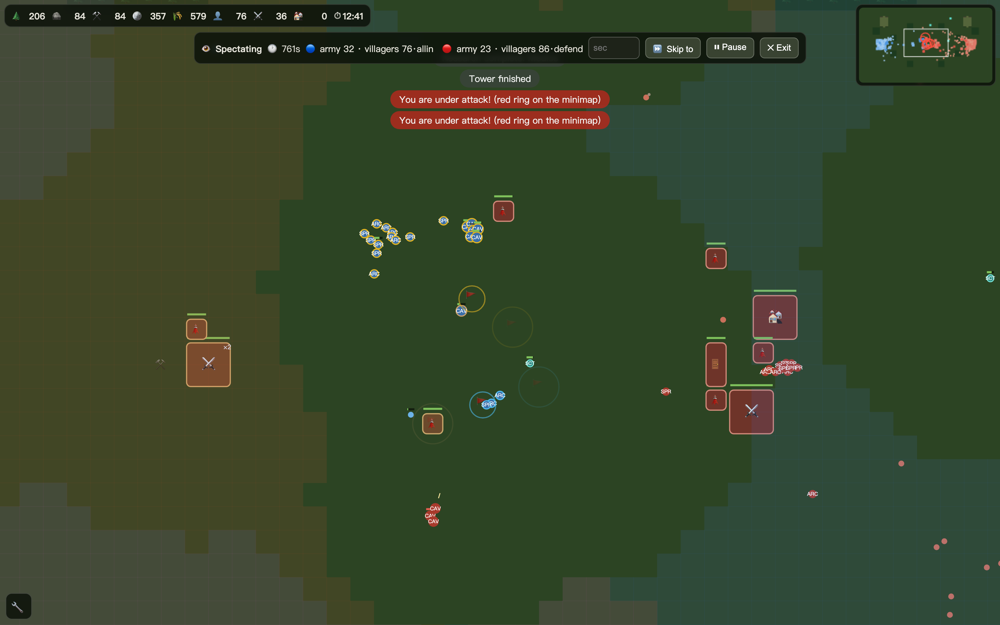

# Medieval RTS

[](https://github.com/horowolf/medieval-rts-web/actions/workflows/tests.yml)

A touch-first real-time strategy game that runs in a browser. One HTML file, no
dependencies, no build step to play it — open the page and you are in a game.

**▶ [Play it here](https://horowolf.github.io/medieval-rts-web/)** · works on
desktop and on a phone · [中文版](https://horowolf.github.io/medieval-rts-web/zh/)



<sub>Two AI opponents playing each other — one all-in, one defending. Group
tags, engagement rules and the fog each side is under are all visible in
spectator mode.</sub>

---

## What it is

An RTS built around one design question: *can a strategy game reward thinking
well instead of clicking fast?*

Traditional RTS skill is largely execution — actions per minute, unit-by-unit
micromanagement, memorised build orders. That is a real skill, and it is also
what makes the genre unplayable on a touchscreen and unwelcoming to new players.
So the rule here is **decisions belong to the player, execution belongs to the
rules**:

- You give a group an **order and an engagement rule** ("attack, counter-pick
  targets, kite"), not a click per unit. The rules then execute it
  deterministically — focus fire, formation by weapon reach, kiting, retreat.
- Villagers manage themselves within a **policy you set** (gathering split, what
  to do when raided). You do not shepherd them one at a time.
- Nothing in the game rewards a faster hand. Dragging a unit is a one-shot
  correction that cannot be box-selected, so hand-placing a formation is
  impossible by construction.

Everything else follows from that: what the AI is allowed to do, why the fog of
war is enforced so strictly, why a "hidden unit" is a consequence of
line-of-sight arithmetic rather than a special case.

## What is in it

| | |
|---|---|
| **Economy** | Five resources, villagers with automatic gathering policies, farms and coppices as renewable sources, a market with drifting exchange rates |
| **Combat** | Rock-paper-scissors triangles on land and at sea, formation by weapon reach, focus fire, kiting, siege setup time, splash falloff, evasion by movement |
| **Terrain** | Cliffs with real width, ramps, forests that block line of sight tile by tile, marsh and shallows that slow movement, bridges and fords |
| **Fog of war** | Strictly enforced for both sides. Remembered buildings persist as ghosts; unit positions do not |
| **Civilisations** | One shared tech tree with a per-civilisation mask, three civilisations, unique units that double as intelligence tells |
| **Naval** | Fishing, transports, an independent naval combat triangle, island expansion |
| **Opponent AI** | Six difficulties, three brain layers, plays through the same command set the player has |
| **Saves** | Full state snapshots in the browser, exportable to a file |
| **Maps** | Five, each strictly mirrored left to right |

## The AI

The most interesting part of the project, and the part that took the longest.

**The opponent is a player that follows the rules.** It acts on the world only
through a whitelist of the player's own commands — it cannot touch a unit's
internals, teleport anything, or conjure resources. Placement, cost, unlock, age
and starvation checks apply to it exactly as they do to you. Cut off its food
supply and its army shrinks, because it pays upkeep from the same ledger.

**It has to scout.** Army positions and composition are never handed to it, at
any difficulty. It sends scouts, its information decays, and it acts on memory
that may be out of date. Getting this right meant modelling *uncertainty*, not
just visibility: an early version made scouting a pure penalty, because an AI
that never scouted assumed the map was empty and attacked confidently, while one
that scouted saw the truth and hesitated — and lost to it.

**The hard difficulties are handicapped, and say so.** Above a certain tier the
AI gets a stated gathering multiplier and an upgrade allowance, printed in the
difficulty menu and generated from the same table that applies them. It never
gets to see through the fog. "Harder" means a bigger economy, never better
information.

It runs three brain layers on different clocks — economy (~2s), strategy (~10s),
tactics (~1.2s) — over a shared demand-scoring pool: every domain proposes,
proposals are ranked, and reservations bind at the spending end so a
low-priority plan cannot starve a high-priority one. At the top difficulties a
small learned linear policy can take over strategic mode selection, falling back
to the rules whenever it is not loaded.

You can watch two AIs play each other: **⚙️ → 👁 Watch AI vs AI**.

## Determinism

The whole simulation is deterministic: fixed timestep, a seeded PRNG, and no
wall-clock or iteration-order dependencies in any decision path. The same seed
replays the same game exactly.

That is not a feature for players — it is the tool that made the rest possible.
It means a balance question can be *measured* rather than argued about, an AI
change can be A/B'd against its own baseline, and a regression shows up as a
world-state fingerprint that differs by one bit.

The English and Chinese builds published here are verified to produce identical
world fingerprints after 3,000 simulation ticks, which is how translating the
interface is proven not to have touched behaviour.

## Engineering notes

- **One file, zero dependencies.** No framework, no bundler, no network
  requests. The whole game is `index.html`: canvas rendering, simulation, AI,
  UI, audio and save system. It loads from `file://` and from static hosting
  alike.
- **Data-driven where it counts.** Adding a unit is adding a row to a table: the
  formation system, the AI's threat weighting, the counter relationships and the
  production panel all pick it up without any code naming that unit.
- **Tests.** [559 headless assertions](tests/README.md) drive the real page
  through the Chrome DevTools Protocol and check simulation behaviour, not DOM
  snapshots — pathfinding, fog, combat maths, AI command legality, save/load
  determinism. Run them yourself with `node tests/headless-test.mjs`. Most of
  them pair a mechanism firing with a control run where it is switched off,
  because a test that would still pass with the feature deleted is not evidence.
- **Profiled, not guessed.** Pathfinding was 85% of simulation time on the large
  maps; the fix was a binary heap that had to be proven bit-identical to the
  linear scan it replaced, ties and all, so no balance baseline moved.

## Repository layout

```
index.html        the game, English UI          (generated)
zh/index.html     the game, original Chinese UI (generated)
tests/            the headless regression suite (generated)
tools/            the build that produces all three from the development source
docs/             architecture notes
```

`index.html` is generated — do not edit it directly. See
[docs/ARCHITECTURE.md](docs/ARCHITECTURE.md) for how the pieces fit together and
[tools/README.md](tools/README.md) for what the build does.

Add `?dev=1` to the URL to reveal the development tools: a debug overlay with
coordinates, paths and a movement log, and an arena for running test battles
between arbitrary armies.

## About this repository

This is a **public, English rebuild** of a project developed privately in
Chinese. The history here was written for publication — it tracks the work of
deriving these files from the development source, not the game's own commit log
— and the interface, code comments and documentation were translated as part of
publishing it. The private repository holds the development history, the design
specifications and the research notes.

**The code was written by AI** — Claude, directed by me across many sessions. I
did the parts that decide whether a game is any good: the design, the
architecture, every balance judgement, and the call on what evidence was needed
before believing a change had worked. The interesting problems here were not
typing problems. Working out that "scouting makes the AI lose" was a missing
uncertainty model rather than a bug, or that win rate is a misleading balance
metric because integer damage thresholds make it binary and you have to measure
surviving health instead — those are the decisions this project is a record of,
and the reason it has the shape it has.

## Licence

[MIT](LICENSE).
